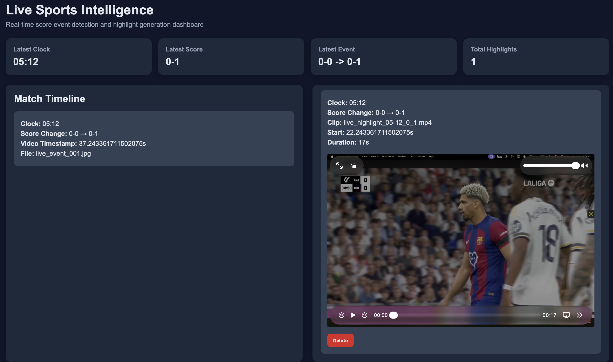

# Live Sports Intelligence

A soccer-focused real-time video intelligence system that detects scoreboard-driven score-change events, generates highlight clips, streams events through Kafka, and visualizes results in a live dashboard.

---

## Overview

This project transforms raw sports video into actionable insights by:

- Detecting scoreboard changes using computer vision
- Filtering noisy detections with temporal smoothing
- Generating highlight clips around key events
- Streaming events through Kafka
- Serving data via Spring Boot APIs
- Visualizing everything in a React dashboard with Grafana monitoring

---

## Current Scope

This version is focused on soccer and is optimized for the trained scoreboard layout used in the demo pipeline.

It supports:

- Offline video processing via Docker
- Local live screen monitoring on the user's device
- Kafka-based event streaming
- Spring Boot APIs with PostgreSQL persistence
- React dashboard with highlight playback

---

## Features

- Real-time scoreboard detection from video or live screen
- Noise-resistant event detection using temporal smoothing
- Accurate highlight generation with timestamp refinement
- Continuous recording with FFmpeg for smooth playback
- Kafka-based event streaming pipeline
- PostgreSQL-backed storage for events and highlights
- Live React dashboard with video playback
- Prometheus + Grafana for system monitoring
- Delete highlights with confirmation (UI + backend sync)
- One-command Dockerized offline pipeline execution

---

## UI Preview

### Main Dashboard


---

## How It Works

1. **Video / Screen Input**
   - Recorded match video (offline mode)
   - Live screen capture (local mode)

2. **Scoreboard Detection**
   - YOLO detects scoreboard region
   - Digit classifier extracts score and clock

3. **Event Detection**
   - Temporal smoothing removes OCR noise
   - Score changes trigger events

4. **Event Streaming**
   - Events are published to Kafka

5. **Highlight Generation**
   - Continuous recording via FFmpeg
   - Clips are cut using refined timestamps

6. **Backend Processing**
   - Spring Boot consumes events
   - Stores data in PostgreSQL

7. **Visualization**
   - React dashboard displays:
     - latest score
     - timeline
     - highlight clips

---

## Architecture

```text
[ Video File ] or [ Local Screen Capture ]
                    ↓
        [ Python Detection Pipeline ]
   (YOLO + Digit Classifier + Smoothing)
                    ↓
                  Kafka
                    ↓
         [ Spring Boot Backend API ]
              ↓                 ↓
       PostgreSQL DB       Prometheus
              ↓                 ↓
       React Dashboard       Grafana
```
---

## Tech Stack

### Backend
- Java
- Spring Boot
- Spring Kafka
- Spring Data JPA
- PostgreSQL

### Video / AI Pipeline
- Python
- OpenCV
- YOLO (Ultralytics)
- PyTorch (Digit Classifier)
- FFmpeg
- NumPy

### Streaming / Infra
- Apache Kafka
- Zookeeper
- Docker Compose

### Frontend / Monitoring
- React
- Axios
- Prometheus
- Grafana

---

## Project Structure

```bash
live-sports-intelligence/
├── docker-compose.yml          # Full stack orchestration
├── pipeline.Dockerfile         # Offline pipeline container
├── backend-api/                # Spring Boot APIs
│   └── Dockerfile
├── frontend/                   # React dashboard
│   ├── Dockerfile
│   └── nginx.conf
├── video-ingestion/            # Detection + live monitor
├── highlight-service/          # Generated clips
├── infra/                      # Prometheus config and legacy infra
├── training/                   # YOLO + digit classifier training
├── sample-videos/              # Test videos
├── assets/                     # Screenshots / media
└── README.md
```

---

## Setup & Run

### Offline Mode (Fully Dockerized)

Starts the full system and runs the offline pipeline once.

```bash
docker compose up --build
```

Services:
- Frontend: http://localhost:5173
- Backend API: http://localhost:8080
- Grafana: http://localhost:3000
- Prometheus: http://localhost:9090

### Live Local Mode

Runs backend + frontend + infra in Docker and live detection locally.

```bash
docker compose up --build

cd video-ingestion
source .venv/bin/activate
pip install -r requirements.txt
python live_screen_monitor.py
```
Notes:
- Live mode runs locally (not fully containerized)
- Requires screen recording permissions
- Works best with visible scoreboard and supported layout

### Key API Endpoints

- GET /api/dashboard/summary
- GET /api/events
- GET /api/highlights
- GET /api/highlights/latest
- GET /api/highlights/file/{clipFile}
- DELETE /api/highlights/{id}/with-event

---

## Dashboard

Access:
```bash
http://localhost:5173
```
Displays:
- Latest clock & score
- Latest event
- Match timeline (deduplicated)
- Highlight clips with playback
- Delete option for highlights

---

## Monitoring

Access Grafana:
```bash
http://localhost:3000
```
Tracks:
- events processed
- highlights generated
- Backend performance metrics
- System health and usage

---

## Future Improvements

- Multi-sport support (basketball, cricket, etc.)
- Fully generalized scoreboard detection
- Audio-assisted event refinement
- ML-based goal detection beyond scoreboard changes
- WebSocket-based real-time updates
- Cloud deployment (AWS/GCP)
- Automated video storage cleanup
---

## Author

Naitik Shah

---

## Summary

This project demonstrates a full-stack, real-time system combining:
- computer vision
- event-driven architecture
- distributed systems
- backend APIs
- frontend visualization
